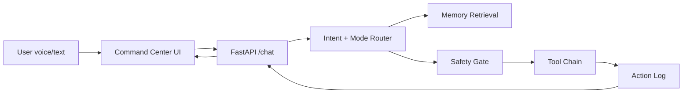

# VERONICA Architecture

## Mission

VERONICA is a personal AI operating assistant with a command-center interface, voice activation, persistent memory, developer tools, and guarded autonomous execution.

## Product Modes

| Mode | Purpose | Behavior |
| --- | --- | --- |
| JARVIS | General intelligence | Balanced assistant, concise analysis, proactive suggestions |
| FRIDAY | Productivity | Planning, calendar, reminders, email drafts, focus recommendations |
| VERONICA | Emergency/problem-solving | Incident triage, risk analysis, decision recommendations |
| SENTINEL | Security monitoring | Threat checks, permission review, action logs, suspicious activity alerts |

## System Layers

1. **Frontend Command Center**
   - Next.js app
   - Tailwind for layout and glass/HUD styling
   - Framer Motion for panels, diagnostics, and status transitions
   - Three.js arc-core visualization
   - Web Speech API for wake phrase and speech-to-text

2. **API Gateway**
   - FastAPI
   - `/chat` for assistant turns
   - `/protocols/deploy` for protocol commands
   - `/memory` for notes and retained facts
   - `/actions` for autonomous action logs

3. **Agent Orchestration**
   - Intent router
   - Mode policy
   - Tool registry
   - Safety classifier
   - Confirmation gate for dangerous commands
   - Action logger

4. **Memory**
   - PostgreSQL for durable users, tasks, reminders, notes, logs
   - Vector database for semantic memory retrieval
   - Redis for short-lived session context, streaming state, and job queues

5. **Tooling**
   - Web research agent
   - Coding assistant agent
   - File analysis agent
   - Calendar/email/reminder connectors
   - Safe shell executor

## Safety Model

- High-risk operations require explicit user confirmation.
- Shell commands are categorized before execution.
- API keys never appear in client responses or logs.
- Autonomous actions are recorded with actor, tool, input summary, risk level, confirmation status, and result.
- Developer mode proposes commands before execution unless policy marks them low risk.

## Request Flow

## MVP vs Advanced Build

### MVP

- Text chat
- Browser wake phrase
- Simulated telemetry
- Protocol routing
- Local memory stub
- OpenAI-compatible backend adapter
- Guarded tool schemas

### Advanced

- Streaming responses
- Whisper transcription pipeline
- ElevenLabs or OpenAI TTS voice
- Supabase/PostgreSQL persistence
- Redis jobs
- Real repository indexing
- Calendar/email OAuth integrations
- Containerized code sandbox
- Multi-agent planner/executor/verifier loop

